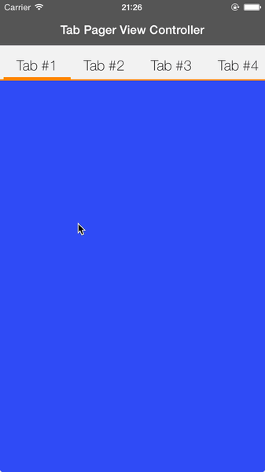

# GUITabPagerViewController

[](http://cocoadocs.org/docsets/GUITabPagerViewController)
[]()
[]()
[]()
[]()



## Installation
**CocoaPods** (recommended)
Add the following line to your `Podfile`:
`pod 'GUITabPagerViewController', '~> 0.1.3'`
And then add `#import <GUITabPagerViewController.h>` to your view controller.

**Manual**
Copy the folders `Classes` to your project, then add `#import "GUITabPagerViewController.h"` to your view controller.

## Usage
To use it, you should create a view controller that extends `GUITabPagerViewController`. Write your `viewDidLoad` as follows:

```obj-c
- (void)viewDidLoad {
  [super viewDidLoad];
  [self setDataSource:self];
}

- (void)viewWillAppear:(BOOL)animated {
  [super viewWillAppear:animated];
  [self reloadData]; }
```

Then, implement the `GUITabPagerDataSource` to populate the view.
The data source has a couple of required methods, and a few more optional.

### Data Source
The data source methods will allow you to provide content to your tab pager view controller.

#### Required Methods
```obj-c
- (NSInteger)numberOfViewControllers;
- (UIViewController *)viewControllerForIndex:(NSInteger)index;
```

#### Optional Methods
**Note that despite being optional, the tab setup will require you to return either a `UIView` or an `NSString` to work.**

```obj-c
- (UIView *)viewForTabAtIndex:(NSInteger)index;
- (NSString *)titleForTabAtIndex:(NSInteger)index;
- (CGFloat)tabHeight;  // Default value: 44.0f
- (UIColor *)tabColor; // Default value: [UIColor orangeColor]
- (UIColor *)tabBackgroundColor; // Default: [UIColor colorWithWhite:0.95f alpha:1.0f];
- (UIFont *)titleFont; // Default: [UIFont fontWithName:@"HelveticaNeue-Thin" size:20.0f];
- (UIColor *)titleColor; // Default: [UIColor blackColor];
- (CFGloat)bottomLineHeight; // Default: 2.0f;
```

### Delegate
The delegate methods report events that happened in the tab pager view controller.

#### Optional Methods
```obj-c
- (void)tabPager:(GUITabPagerViewController *)tabPager willTransitionToTabAtIndex:(NSInteger)index;
- (void)tabPager:(GUITabPagerViewController *)tabPager didTransitionToTabAtIndex:(NSInteger)index;
```

### Public Methods
There are two public methods:

```obj-c
- (void)reloadData;
- (NSInteger)selectedIndex;
```

`reloadData` will refresh the content of the tab pager view controller. Make sure to provide the data source before reloading the content.

`selectedIndex` will return the index of the current selected tab.
